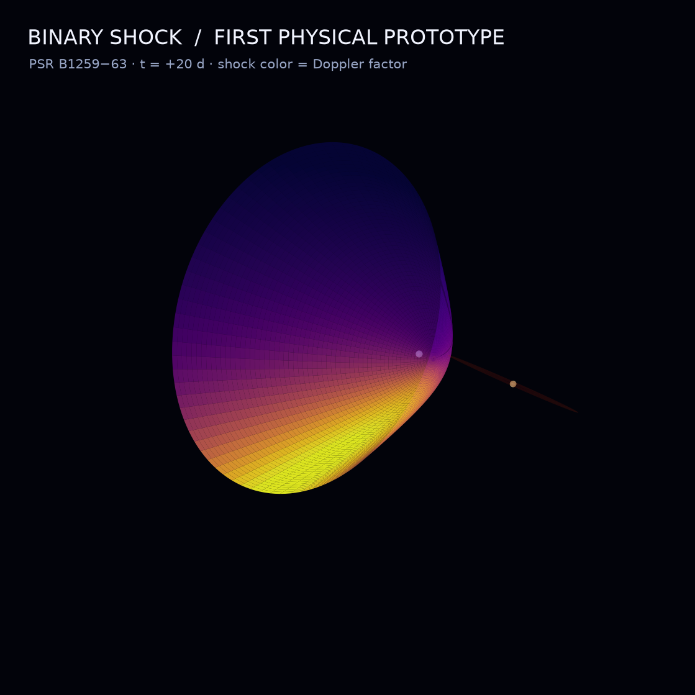

# Binary Shock

An interactive, physics-informed visualization of the analytic intrabinary
shock model implemented by [IBSEn](https://github.com/juliagouveamamprim/IBSEn).

The first milestone exports a frozen PSR B1259−63 scene to GLB for visual
experiments in Sketchfab. The goal is a cinematic scientific diorama whose
geometry and scalar mappings remain traceable to the model. Binary Shock does
not claim to be a 3D hydrodynamic simulation.



## Prototype pipeline

```text
IBSEn (Python) -> GLB + scientific metadata -> Sketchfab
```

The GLB contains the analytic shock surface, Be star, decretion disk, and a
display-scale pulsar. A JSON sidecar records physical parameters, field ranges,
units, and every deliberate visual exaggeration.

## Reproduce the first asset

Create an isolated Python 3.12 environment and install the project. The
dependency declaration pins the exact upstream IBSEn revision used for this
prototype.

```bash
python3.12 -m venv .venv
.venv/bin/python -m pip install .
MPLCONFIGDIR=/tmp/binary-shock-mpl .venv/bin/python generator/export_scene.py
```

For local co-development, an editable clone of IBSEn may be installed instead.
The clone itself is intentionally excluded from this repository.

Outputs:

- `public/models/binary-shock-v0.1.glb`
- `public/models/binary-shock-v0.1.metadata.json`
- `public/previews/binary-shock-v0.1.png`

The PNG is only a QA preview. Materials, lighting, environment, and
post-processing will be evaluated in Sketchfab.

## Scientific scope

See [`docs/scientific-basis.md`](docs/scientific-basis.md) for the distinction
between model-derived quantities and artistic presentation choices.

See [`docs/roadmap.md`](docs/roadmap.md) for planned scientific and cinematic
layers.

## Attribution

The analytic shock and emission calculations come from
[IBSEn](https://github.com/juliagouveamamprim/IBSEn), distributed under the MIT
License. Binary Shock is a separate visualization project and does not vendor
the IBSEn source code.
